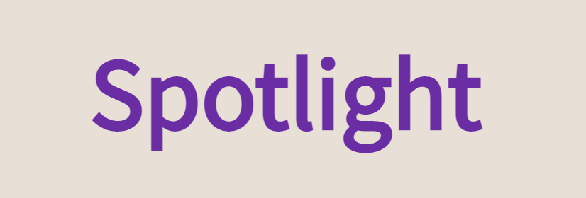

<picture>
  <source media="(prefers-color-scheme: dark)" srcset="public/img/spotlightTitle.PNG">
  <source media="(prefers-color-scheme: light)" srcset="public/img/spotlightTitle.PNG">
  
</picture>

# For QA Testing
Assuming you arrived at this repo to test out Spotlight or do some QA testing, the steps below are for you if you haven't downloaded files from GutHub before.

### Option 1 (Run Locally)
- Click on the green **Code** button, and press ```download ZIP```
- Open the ZIP folder, and **Extract all**
- Go to the unzipped folder and open it
- Double click the ```index.html``` file and open it with your browser

### Option 2 (Local Server [recommended])
- Downlaod [VS Code](https://code.visualstudio.com/)
- Download the [Live Server](https://marketplace.visualstudio.com/items?itemName=ritwickdey.LiveServer) extension
- Clone the repo, or download the files as detailed above
- Open the cloned repo in VS Code
- ```CMD+SHIFT+P``` // ```CTRL+SHIFT+P``` to open commands, then click **Start Live Server**
- If you open to a file tree, navigate to ```public```

# For Development
In order to authenticate yourself while working on the code you will need to login using firebase. Firebase only works when running locally if you are using localhost on 
port 80 / 'no port'. Firebase **DOES NOT WORK** when running locally from a port that is not 80 OR none (which is technically 80).

# Reporting Issues
Please let me know if any major bugs or issues arise by contacting me personally or opening a new Issue in the Issues tab.
